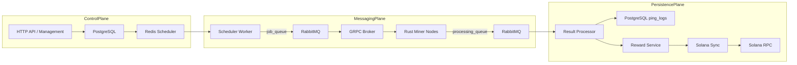
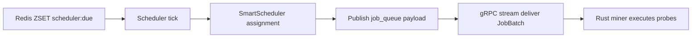
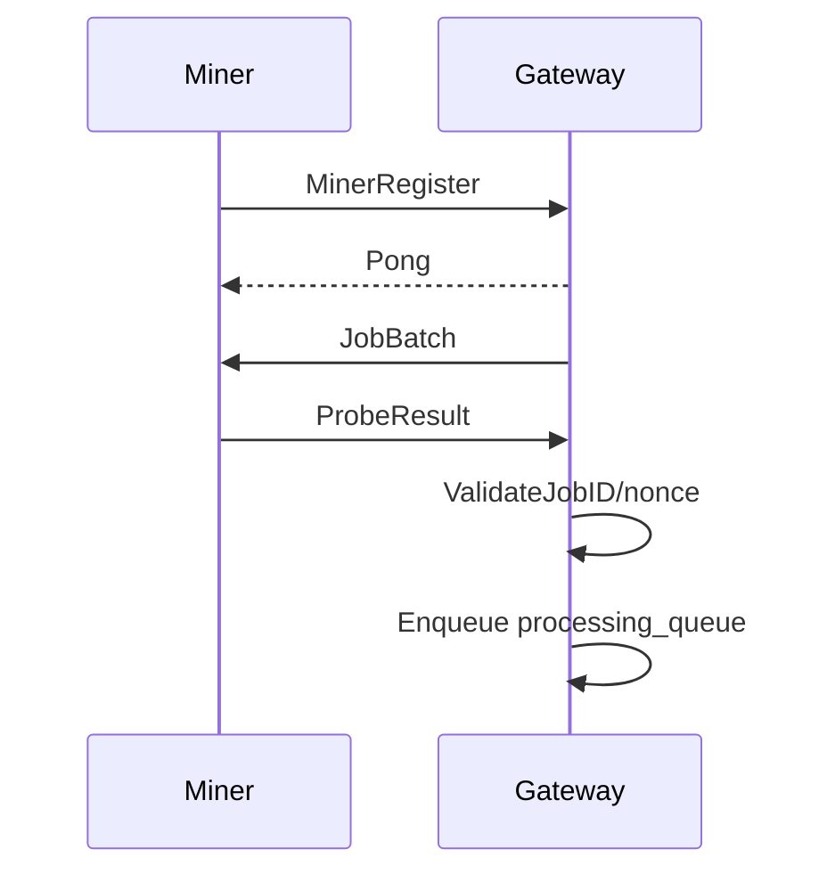
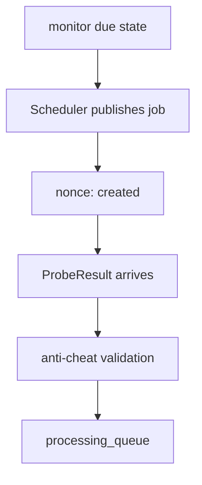
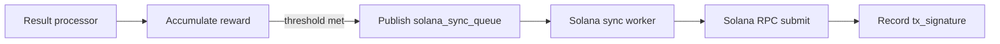

<div align="center">

# ⬡ DePIN Uptime Monitor — Go Backend

**Hybrid push-pull distributed uptime orchestration with Solana reward settlement**

[](https://go.dev)
[](LICENSE)
[](https://grpc.io)
[](https://solana.com)
[](https://rabbitmq.com)

</div>

---

## Table of Contents

- [Overview](#-overview)
- [Features](#-features)
- [Architecture Overview](#-architecture-overview)
- [Tech Stack](#-tech-stack)
- [Folder Structure](#-folder-structure)
- [Distributed Scheduling Pipeline](#-distributed-scheduling-pipeline)
- [gRPC Streaming Infrastructure](#-grpc-streaming-infrastructure)
- [RabbitMQ Queue Architecture](#-rabbitmq-queue-architecture)
- [Redis Scheduling System](#-redis-scheduling-system)
- [PostgreSQL Time-Series Design](#-postgresql-time-series-design)
- [Anti-Cheat Engine](#-anti-cheat-engine)
- [Solana Reward System](#-solana-reward-system)
- [Scalability](#-scalability)
- [Performance Optimization](#-performance-optimization)
- [Security](#-security)
- [Local Development Setup](#-local-development-setup)
- [Environment Variables](#-environment-variables)
- [Docker Architecture](#-docker-architecture)
- [API Examples](#-api-examples)
- [Future Roadmap](#-future-roadmap)
- [Contributing](#-contributing)
- [License](#-license)
- [Author](#-author)

---

## 🔭 Overview

This repository implements a production-grade backend for a distributed uptime monitoring DePIN platform.

It is designed for large-scale observability, off-chain reward accumulation, and blockchain settlement. The system operates as a centrally orchestrated scheduler with asynchronous persistent miner streams and queue-based durability.

### Core workflow

1. Website owners register uptime monitors
2. Redis scheduler marks monitors as due
3. Smart scheduler assigns jobs to runner nodes
4. RabbitMQ dispatches targeted monitoring jobs
5. gRPC streams deliver jobs to Rust miners
6. Miners execute HTTP probes and collect telemetry
7. Probe results stream back through gRPC
8. Anti-cheat validation verifies each result
9. PostgreSQL stores append-only telemetry
10. Rewards accumulate off-chain
11. Solana sync workers batch blockchain updates
12. Runners claim SPL rewards

---

## 🚀 Features

- Hybrid push-pull distributed scheduling
- Persistent bidirectional gRPC miner streams
- RabbitMQ targeted dispatch and processing queues
- Redis state for monitor due-time, nonce validation, and cache
- Weekly PostgreSQL RANGE partitioning for telemetry
- Microsecond latency metrics with DNS, TCP, TLS, TTFB, and total phases
- Off-chain reward accounting with threshold-driven Solana settlement
- JWT authentication and replay protection
- Anti-cheat verification for fake latency and rate abuse
- Docker Compose local integration

---

## 🧠 Architecture Overview

This architecture blends centralized orchestration and edge execution.

- Scheduler operates centrally using Redis state
- Miner nodes consume asynchronously over long-lived gRPC streams
- RabbitMQ separates dispatch from ingestion and persistence
- PostgreSQL stores immutable telemetry and domain state
- Solana is the settlement layer for validated reward payouts

### Overall infrastructure



---

## 🧩 Tech Stack

| Layer | Technology |
|---|---|
| Backend | Golang |
| Edge Miner | Rust |
| Scheduling | Redis |
| Queue | RabbitMQ |
| Communication | gRPC, Protobuf, WebSockets |
| Storage | PostgreSQL |
| Blockchain | Solana SPL Token |
| Auth | JWT |
| Infrastructure | Docker, Docker Compose |

---

## 📁 Folder Structure

```bash
anticheat/
│   └── validator.go

app/
│   └── application.go

config/
│   ├── db/
│   │   └── db.go
│   └── env/
│       └── env.go

controllers/
│   ├── monitor.go
│   ├── ping.go
│   └── user.go

db/
│   └── repositories/
│       ├── monitor.go
│       ├── runners.go
│       ├── storage.go
│       └── user.go

grpc/
│   ├── pb/
│   │   ├── monitor_grpc.pb.go
│   │   └── monitor.pb.go
│   └── server.go

middleware/
│   └── jwt.go

proto/
│   └── monitor.proto

router/
│   └── router.go

services/
│   ├── monitor_service.go
│   ├── ping_log_service.go
│   ├── registry.go
│   ├── reward_service.go
│   ├── runner_service.go
│   └── user_service.go

solana/
│   └── solana_client.go

workers/
│   ├── partition_cron.go
│   ├── result_processor.go
│   ├── schedular.go
│   └── solana_sync.go

main.go
schema.sql
docker-compose.yml
Makefile
README.md
```

### Folder responsibilities

- `anticheat/`: runtime validators and fake-latency heuristics.
- `app/`: wiring of services, repositories, workers, and server startup.
- `config/`: environment loading and database bootstrap.
- `controllers/`: HTTP control-plane endpoints for monitors, users, and ping actions.
- `db/repositories/`: persistence abstractions for domain entities.
- `grpc/`: gRPC server implementation, miner lifecycle management, and RabbitMQ bridging.
- `middleware/`: JWT authentication and request context propagation.
- `proto/`: Protobuf schema for miner-gateway contract.
- `router/`: HTTP router and middleware stack.
- `services/`: core business logic for monitors, runners, rewards, and telemetry.
- `solana/`: Solana RPC and token settlement helpers.
- `workers/`: background runners for scheduler ticks, ingestion, partition maintenance, and blockchain sync.

---

## 🔁 Distributed Scheduling Pipeline

The scheduler is purpose-built for high-throughput monitor dispatch.

- `workers/schedular.go` polls Redis every second
- `scheduler:due` ZSET identifies ready monitors
- `SmartScheduler` maps active runners to target URLs
- jobs are published to RabbitMQ `job_queue`
- nonces are emitted with `nonce:<job_id>` for replay protection
- targeted messages are sent to connected miners over gRPC



---

## 🔗 gRPC Streaming Infrastructure

The gRPC layer is the primary miner transport and control plane.

### Protocol contract

- `MonitorService.JobStream(stream MinerMessage) returns (stream ServerMessage)`
- `MinerRegister`: node identity and version metadata
- `Ping` / `Pong`: heartbeat and keepalive
- `JobBatch`: targeted job delivery
- `ProbeResult`: telemetry ingestion

### Runtime behavior

- persistent miner streams are managed in `grpc/server.go`
- first message must be `MinerRegister`
- `connectedMiner` tracks active nodes and geolocation
- keepalive settings enforce connection health and recovery
- all incoming results are validated before queue insertion



---

## 🐇 RabbitMQ Queue Architecture

RabbitMQ isolates dispatch, ingestion, and settlement.

- `job_queue`: targeted monitor jobs for active miners
- `processing_queue`: validated probe payloads ready for DB persistence
- `solana_sync_queue`: reward settlement jobs for blockchain sync

### Operational semantics

- `job_queue` decouples scheduler load from gRPC delivery
- `processing_queue` supports backpressure and retry handling
- `solana_sync_queue` moves blockchain settlement out of the ingest path

---

## 🧠 Redis Scheduling System

Redis is the coordination layer for monitor due-state, nonce lifecycle, and caching.

### Key state patterns

- `scheduler:due`: sorted set of monitors ordered by due timestamp
- `sched:monitor:<id>`: scheduled monitor membership marker
- `nonce:<job_id>`: single-use job binding to prevent replay
- `cache:active_monitors`: short-lived monitor metadata snapshot

### Validation path

- `ValidateJobID` ensures result authenticity via Redis nonce state
- `CheckRateLimit` enforces submission thresholds per runner
- `DetectFakeLatency` rejects suspicious latency patterns
- atomic Redis operations make replay attacks infeasible



---

## 🗄 PostgreSQL Time-Series Design

PostgreSQL is the authoritative store for append-only telemetry and reward state.

### Core models

- `users`: platform identity and wallet mapping
- `monitors`: target URLs, check interval, credit balance, and lifecycle state
- `runner_nodes`: registered miner nodes, geo metadata, off-chain balance
- `ping_logs`: append-only telemetry partitioned by timestamp
- `solana_sync_events`: idempotent settlement records

### Partitioning strategy

- `ping_logs` is RANGE partitioned on `timestamp`
- weekly partitions are created and maintained by `workers/partition_cron.go`
- partition planner creates 4 weeks ahead to avoid insert failures
- indexes on `(monitor_id, timestamp DESC)` optimize recent history queries

### Latency metrics

- `dns_us`: DNS resolution latency
- `tcp_us`: TCP connect latency
- `tls_us`: TLS handshake latency
- `ttfb_us`: time-to-first-byte latency
- `total_us`: end-to-end probe latency

### Reward accounting

- `accumulate_runner_reward()` executes atomic off-chain balance updates
- threshold logic preserves fractional token values
- reward settlement is gated on `10` token minimum to reduce chain churn

---

## 🛡 Anti-Cheat Engine

Anti-cheat validation is enforced before any persistence or reward update.

- JWT authentication secures the HTTP API
- `ValidateJobID` verifies nonce-bound job identifiers
- replay attack prevention protects against stale probe results
- `DetectFakeLatency` evaluates suspicious timing fingerprints
- `CheckRateLimit` protects miner streams from abusive submitters

<details>
<summary>Anti-cheat workflow</summary>

- Miner registers with `MinerRegister`
- Gateway updates heartbeat state
- `ProbeResult` is checked against Redis nonce state
- suspicious results are dropped before queue publish
- rate and latency heuristics block invalid telemetry

</details>

---

## 💰 Solana Reward System

The reward system separates off-chain accumulation from on-chain settlement.

- `rewardSvc.AccumulateAndMaybeSync` increases `runner_nodes.offchain_accumulated_tokens`
- once the threshold is met, a sync task is published to `solana_sync_queue`
- `workers/solana_sync.go` consumes the queue and submits settlement RPCs
- `solana_sync_events` records `tx_signature` for idempotency
- `pending_solana_sync` is cleared only after transactional confirmation



---

## 📈 Scalability

- stateless Go service instances scale horizontally
- queue-driven architecture decouples ingestion from processing
- Redis coordinates distributed scheduler state without centralized locks
- RabbitMQ enables independent worker scaling and retry isolation
- weekly PostgreSQL partitions support sustained write throughput
- off-chain reward accumulation avoids payment latency spikes in the ingest path

---

## ⚡ Performance Optimization

- gRPC streaming reduces connection overhead
- async workers maintain write throughput under burst load
- batch processing minimizes repeated DB round-trips
- Redis caching reduces monitor metadata load
- partitioning reduces PostgreSQL query planning costs
- connection pooling for Postgres and RabbitMQ channels is standard

---

## 🔐 Security

- JWT middleware validates bearer token authenticity
- nonce-based job IDs prevent replay and duplicate settlement
- rate limiting protects against noisy or malicious miners
- fake latency heuristics block fabricated probe results
- soft delete + unique indexes enforce operational data hygiene

---

## 🛠 Local Development Setup

### Prerequisites

- Go 1.22+
- Rust toolchain for the edge miner CLI
- Docker & Docker Compose

### Start the stack

```bash
docker compose up -d
```

### Run the backend

```bash
go mod tidy
go run ./main.go
```

### Generate protobuf bindings

```bash
protoc --go_out=. --go-grpc_out=. proto/monitor.proto
```

or if using Buf:

```bash
buf generate
```

### Common Makefile commands

```bash
make build
make test
make docker-up
make docker-down
```

---

## 🌐 Environment Variables

| Variable | Description |
|---|---|
| `DATABASE_URL` | PostgreSQL connection string |
| `REDIS_URL` | Redis connection string for scheduler and nonce storage |
| `RABBITMQ_URL` | RabbitMQ AMQP URI |
| `JWT_SECRET` | Secret for HMAC JWT validation |
| `SOLANA_RPC_URL` | Solana JSON-RPC endpoint |
| `SERVER_PORT` | HTTP/gRPC listen port |

---

## 🐳 Docker Architecture

Docker Compose encapsulates the control plane and integration dependencies.

- PostgreSQL stores user, monitor, runner, and telemetry state
- Redis manages scheduling state, nonces, and cache
- RabbitMQ handles targeted dispatch and worker pipelines
- Go backend exposes REST and gRPC ingress

---

## 📡 API Examples

### Create a monitor

```bash
curl -X POST http://localhost:8080/api/v1/monitors   -H "Authorization: Bearer $JWT_TOKEN"   -H "Content-Type: application/json"   -d '{"target_url":"https://example.com/health","check_interval_seconds":60}'
```

### gRPC stream lifecycle

```text
Miner -> Gateway: MinerRegister(node_id, version, timestamp_ms)
Gateway -> Miner: Pong(server_time_ms)
Gateway -> Miner: JobBatch(batch_id, jobs)
Miner -> Gateway: ProbeResult(job_id, dns_us, tcp_us, tls_us, ttfb_us, total_us)
```

### Query reward sync events

```sql
SELECT runner_pubkey, tx_signature, amount_raw, confirmed_at
FROM solana_sync_events
ORDER BY confirmed_at DESC
LIMIT 10;
```

---

## 🔮 Future Roadmap

- Kubernetes-native deployment and Helm charts
- Prometheus metrics and Grafana dashboards
- OpenTelemetry tracing for gRPC and async workflows
- Kafka / NATS alternative event plane
- ClickHouse analytics for long-term probe retention
- H3 geospatial routing for region-aware assignment
- Multi-region coordinator clusters for resilience

---

## 🤝 Contributing

Contributions should prioritize resilience, observability, and security.

- Open an issue for architecture or behavior changes
- Keep PRs small and focused
- Document scheduler contracts and retention assumptions
- Preserve gRPC protocol compatibility

---

## 📄 License

MIT

---

## 👤 Author

Everest Paudel  
Backend Engineer | Distributed Systems | Blockchain Infrastructure  
GitHub: https://github.com/everestp
